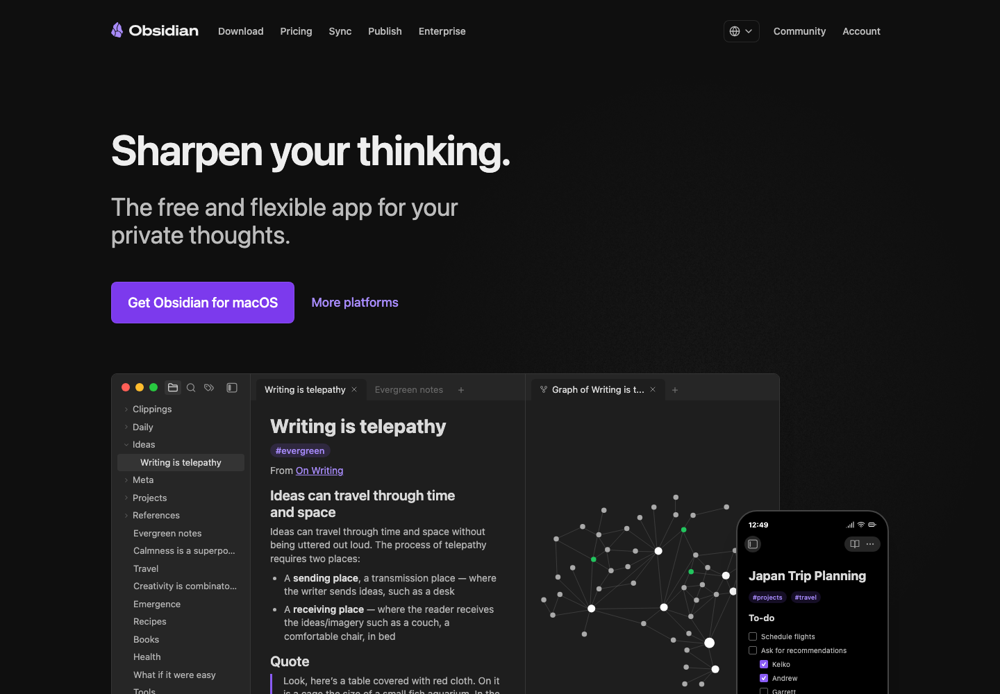

# 中文知识管理与 Obsidian 工作流

知识管理最容易变成装修软件。目录、标签、双链、模板、插件都很迷人，但最后能留下来的还是每天愿意写进去的那套流程。

别先设计第二大脑，先设计入口：网页怎么进来，论文怎么进来，项目记录怎么进来，每周怎么清一次。

## 先看这几个

Obsidian / Logseq / Notion / Anytype

先把 Obsidian/Zotero/Readwise 或同类组合跑通，再考虑插件美化。

## 入口

| 名称 | 我为什么留它 |
| --- | --- |
| [Obsidian](https://obsidian.md/) | 本地 Markdown 知识库。 |
| [Logseq](https://logseq.com/) | 开源大纲式知识管理。 |
| [Notion](https://www.notion.so/) | 在线协作文档和数据库。 |
| [Anytype](https://anytype.io/) | 本地优先对象式知识管理。 |
| [Readwise Reader](https://readwise.io/read) | 稍后读和高亮管理。 |
| [Zotero](https://www.zotero.org/) | 文献管理。 |
| [Mermaid](https://mermaid.js.org/) | 文本生成流程图。 |
| [Excalidraw](https://excalidraw.com/) | 手绘风白板。 |

## 我的使用顺序

- 先确定信息入口：网页、论文、日记、项目。
- 使用统一目录和模板，不要一开始沉迷插件。
- 每周做一次整理和归档。

## 别踩坑

- 知识库最大敌人是过度设计。
- 云同步前要想清楚隐私和备份。

## 截图来源

这张图来自公开页面：[https://obsidian.md/](https://obsidian.md/)。如果页面改版，截图可能会和当前官网略有出入。

## 维护方式

链接数据放在 [`data/links.json`](data/links.json)。我倾向于少而准：入口失效就换，说明过时就改，不把这里做成什么都往里塞的大杂烩。

## License

MIT. 第三方商标、页面截图和网站内容归原权利方所有；本仓库只做中文导航和使用笔记。
